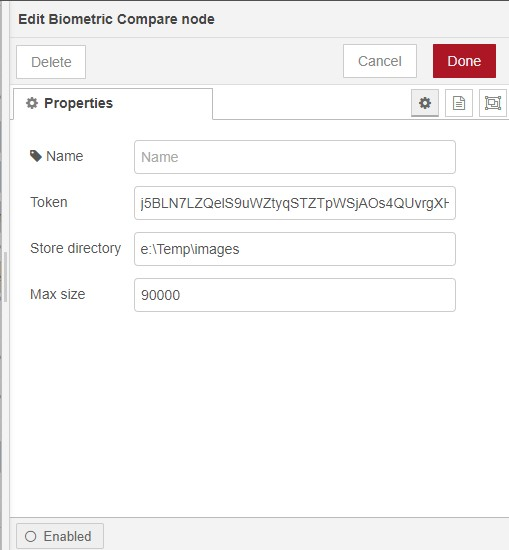

# [node-red-contrib-biometricvision][2]

[Node Red][1] node for determining if a person matches between two digital images returning probability factors on key metric using api's from [Biometric Vision][4].

Features:

*   Auto resize if image payload size too large
*	Reduce max size for performance
*   Save and cache reference image for performance and 
 

------------------------------------------------------------

## face compare

Defines a face comparing node using [Biometric Vision][4] service. Can compare two images or store an image as a reference point. Images are cached for hour to minimise overhead on many compares against single image.  Auto resize of images to below 1 MB if image too large for [Biometric Vision][4] call.

Token is obtained from [Biometric Vision][4] site.  Has free usage for small amount of testing.

Topics can be set to control

Cache/< identifier >	Put image in payload into cache

compare/< identifier > 	Compare image payload with image associated with identifier

save/< identifier > 	Put image in payload into cache and persist file system

clearCache Clear the cache

otherwise compares payload.image1 to payload.image2

------------------------------------------------------------

# Install

Run the following command in the root directory of your Node-RED install or via GUI install

    npm install node-red-contrib-biometricvision

from [github repro][2]

------------------------------------------------------------

# Version

0.0.3 change from request to http.  Fix bug in sending to unmatch port and add match flag.

0.0.2 initial release

# Author

[Peter Prib][3]

[1]: http://nodered.org "node-red home page"

[2]: https://www.npmjs.com/package/node-red-contrib-biometricvision "source code"

[3]: https://github.com/peterprib "base github"

[4]: https://biometricvision.com "Biometric Vision"
